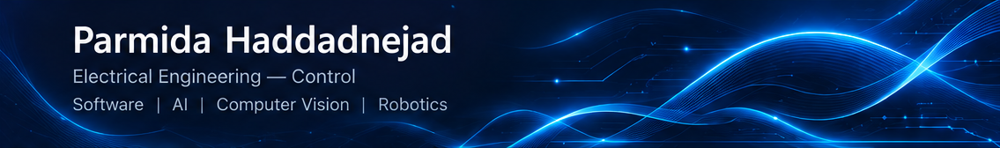
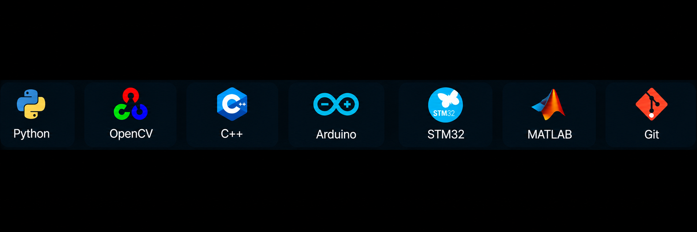

  

<h2>

  &nbsp;Hi, I'm Parmida!
</h2>

  I hold a B.Sc. in Electrical Engineering — Control from Iran University of Science and Technology (IUST), with a background in robotics, embedded systems, and software development. 
  My main interests now are AI and computer vision, especially developing practical applications in these areas. 
  I enjoy working with Python and C++ and using AI, computer vision, and software development to solve real-world engineering problems.

<h2>
  
  &nbsp; Tech Stack
</h2>

  

<h2>
  
  &nbsp; Skills
</h2>

